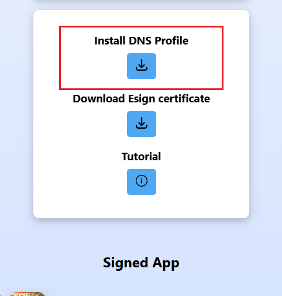
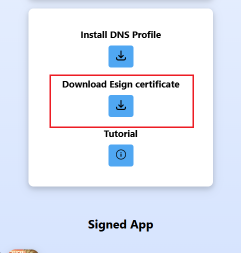
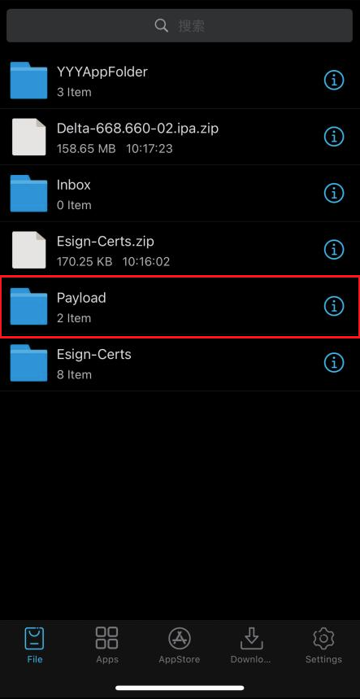

# 📲 How to Install ESign & Sign Delta IPA

- Made by **9in10** (Discord)

Follow this **step-by-step guide** carefully to successfully install and sign the Delta IPA using ESign.

---

## 📥 Prerequisite

✅ **Before you begin:**  
Make sure you have the latest **Delta IPA file downloaded onto your device**:  
👉 [https://deltaexploits.gg/delta-executor-ios](https://deltaexploits.gg/delta-executor-ios)

⚠ **Important:**  
This guide assumes you have **basic experience using iOS devices**, including:  
- Knowing how to navigate **Settings**  
- Understanding how to **install and trust profiles**  
- Knowing where downloaded files are stored  
- Using apps or tools to **unzip files on iOS**

If you are unfamiliar with these steps, please research them first or seek help before proceeding.

---

## 🛠 Installation Steps

### **Step 1: Visit the Website**

Go to the official site:  
👉 [https://khoindvn.io.vn/](https://khoindvn.io.vn/)

---

### **Step 2: Install the DNS Profile**

1. On the homepage, tap **“Install DNS”**.  
2. A configuration profile will automatically download.

  

---

### **Step 3: Trust the DNS Profile**

1. Open **Settings** → **General** → **VPN & Device Management**.  
2. Locate the DNS profile.  
3. Tap **Trust** to allow it.

---

### **Step 4: Open the New App**

- After trusting the profile, a **new app icon** will appear on your Home Screen.
- Tap to **open** the app.

---

### **Step 5: Choose an App Source**

1. Inside the app, scroll and select **“HDFC Bank”**.  
2. ⚠ **If HDFC fails to verify, try other available ESign sources**.

---

### **Step 6: Install the ESign Certificate**

1. Return to:  
👉 [https://khoindvn.io.vn/](https://khoindvn.io.vn/)  
2. Tap **“Download ESign Certificate”**.

  

---

### **Step 7: Open the ESign App**

- Launch the **ESign app**.  
- Import the **certificate** (be sure to **unzip** it first).  
- Also import the **Delta IPA** you downloaded earlier.

---

### **Step 8: Import Certificate Management**

1. Inside ESign, tap the **same certificate** you used for installing ESign.  
2. ⚠ **Make sure the certificate name matches the ESign app name**, or it will fail.  
3. Tap **“Import Certificate Management”**.

---

### **Step 9: Unzip the Delta IPA**

1. Tap on the **Delta IPA** file to unzip it.  
2. You should see a folder named **Payload**.

  

---

### **Step 10: Navigate to Signature Folder**

- Go to:  
`Payload > roblox.app > signature > signature`

---

### ✅ **Final Step: You’re Done!**

🎉 Your app is now **signed** and ready to use!

---

## 💬 Need Help?

If you encounter issues or need clarification, feel free to **open an issue** or **ask for support**.

---

✨ **Made with care by 9in10**
